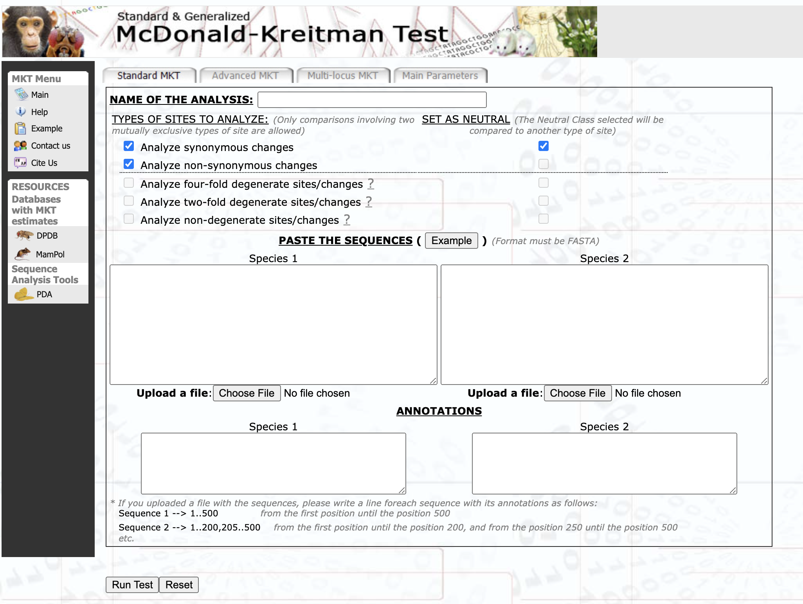
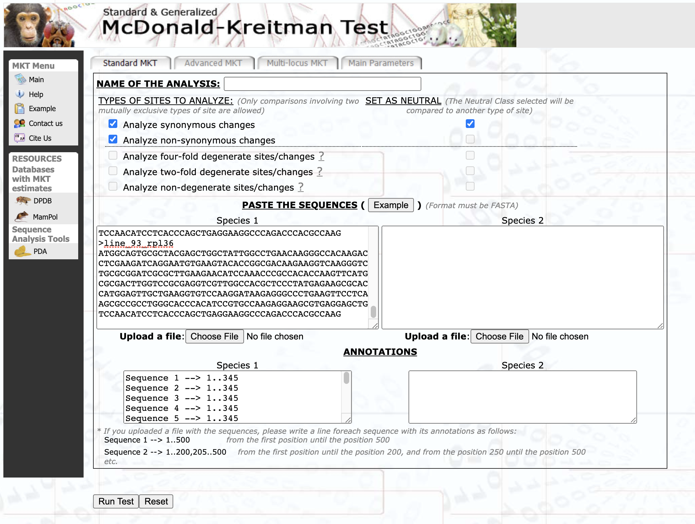
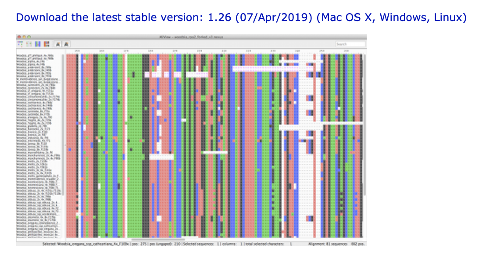
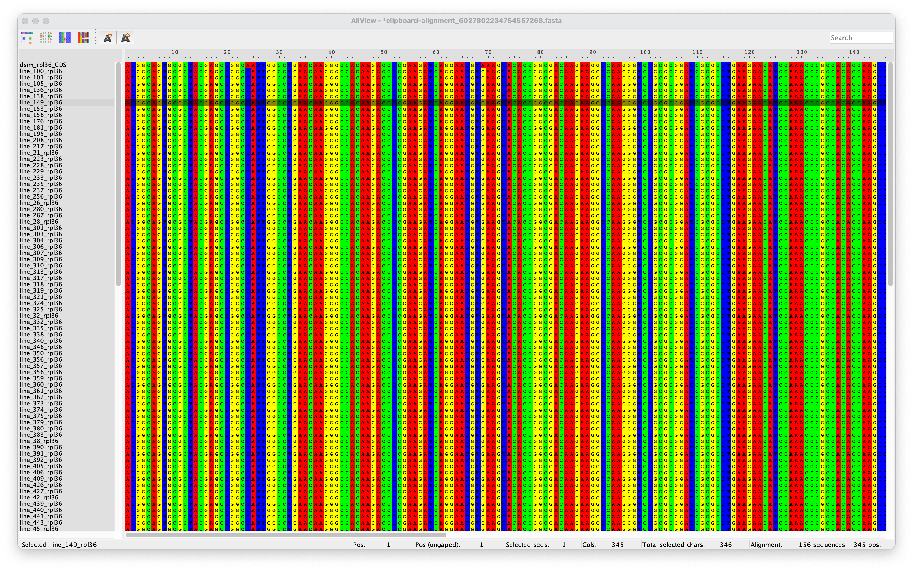
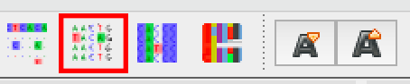

## BIOL 435 - Molecular Evolution

 

# Testing for positive selection: the McDonald-Kreitman (MK) test

## Introduction

In part 1 of this exercise, you will be performing an MK test on sequences from _Drosophila melanogaster_ and its close relative, _Drosophila simulans_. The MK test compares levels of synonymous and non-synonymous polymorphism (PS and PN) to levels of synonymous and non-synonymous divergence (DS and DN). Therefore, several samples are required from the species of interest in order to calculate levels of polymorphism, and at least one sample is required from a second species to calculate levels of divergence. You have been provided with fasta files containing such data for two genes from _D. melanogaster_ and _D. simulans_. Fasta files are commonly used for working with DNA and protein sequences.

**Files for the exercise:**

1. `RpL36_dmel_dgrp.txt` - a fasta file containing sequences for the gene `RpL36` from 155 lines of the DGRP
2. `RpL36_dsim.txt` - a fasta file containing `RpL36` sequence from a single _Drosophila simulans_ individual
3. `Pkd2_dmel_dgrp.txt` - a fasta file containing sequences for the gene `Pkd2` from 62 lines of the DGRP
4. `Pkd2_dsim.txt` - a fasta file containing sequences for the gene `Pkd2` from 2 _Drosophila simulans_ individuals

Although there are a number of specialized software packages that perform the MK test, for convenience we will use a web-based MK test created by researchers in the Department of Genetics and Microbiology at the Universitat Autònoma de Barcelona (`http://mkt.uab.es/mkt/MKT.asp`).

In part 2 of the exercise, you will view an alignment of both genes in order to visualize the polymorphism and divergence present in our sample of _D. melanogaster_ and _D. simulans_.

 

---

# MK test exercise: Part 1 (online MK tests)

### 1. Navigate to the online MK test homepage (`http://mkt.uab.es/mkt/MKT.asp`)

 

On the homepage you will find four text boxes, as shown below. The two boxes on the left are labeled "Species 1", and the two on the right are labeled "Species 2". The top two boxes are for entering sequences from our two species (the bottom two boxes fill automatically). For our comparison, we will use _Drosophila melanogaster_ as Species 1 and _Drosophila simulans_ as Species 2.

 

 

### 2. Enter the _D. melanogaster_ `RpL36` sequences into the "Species 1" box 

- Open the file called `RpL36_dmel_dgrp.txt` in a text editor (the default text editor for Mac is called TextEdit, whereas the default for Windows is called Notepad).

- Once the file is open, select and copy the entire contents of the file.

- Next, return to the MK test homepage and paste the contents of the file into the top box on the left labeled "Species 1".

- The box on the bottom left should then fill automatically, as shown below (you may have to click outside of the text box for the page to refresh).

 

 

### 3. Enter the  _D. simulans_  `RpL36` sequences into the "Species 2" box

- Open `RpL36_dsim.txt` in a text editor.

- Copy the contents of the file.

- Return to the MK test homepage and paste the contents into the top box on the right labeled "Species 2".

- As with Species 1, the bottom box on the right will fill automatically.

 

### 4. Run the test

- Press the "Run test" button and wait for the results page to appear (this should take no longer than a minute or two).

 

### 5. View the results

- Before examining the results in the table at the bottom of the page, first set the results to be presented without any correction for divergence by clicking the corresponding option:

 

### 6. Save the results

- To save the results, copy-paste the results table into a word document along with the chi-squared test statistic and the corresponding p-value (these are printed at the very bottom of the results page).

 

### 7. Perform the MK test with `Pkd2`

- Repeat steps 1-6 using the sequences in `Pkd2_dmel_dgrp.txt` for Species 1 and the sequence in `Pkd2_dsim.txt` for Species 2.

- At the end of step 7, you should have two results tables copied into a word document, as well as their corresponding chi-squared test results (_i.e.,_ a chi-squared test statistic and a p-value for each gene). **Be sure to include these results when you submit the assignment.**

 

---

# MK test exercise: Part 2 (amino acid alignments)

### 1. Download AliView

AliView is a free alignment viewer and editor.

- Navigate to the AliView homepage (`https://ormbunkar.se/aliview/`)
- Download AliView by following the download link near the top of the page (shown below) 

 

### 2. Copy all `RpL36` sequences into the AliView window 

- Open AliView - this will open a blank AliView window.

- Open `RpL36_dmel_dgrp.txt` in a text editor and copy the entire contents of the file.

- Next, return to AliView and paste the contents into the AliView window. This can be done either with `command-v` on a Mac or `control-v` on a Windows machine. Alternatively, right-click in the AliView window and select `Paste sequence(s) from clipboard`.

- Repeat this process with `RpL36_dsim.txt` (copy these sequences into the same window).

- Your AliView window should then look like the following:

- Note that the sequences in `RpL36_dmel_dgrp.txt` and `RpL36_dsim.txt` _are already aligned_, and can therefore be compared as-is. Otherwise, these sequences would first have to be aligned, using either AliView or some other alignment software, before they can be meaningfully compared.

 

 

 

 

 
 
 

### 3. Translate nucleotide sequences to amino acid sequences

- Note the option buttons in the top left-hand corner of the AliView window. You can hover over each button to see what it does.

- Click the button that translates DNA sequences into amino acid sequences. It is the fourth button from the left (highlighted in red below). 

 

### 4. Show amino acid sequence

- Once the sequences have been translated, a new set of buttons will appear in the top-center of the AliView window.

- Hover over these buttons, and click the one that says `"Show Translation as only one Amino Acid character"` (highlighted in red below). This lets us view the amino acid sequences as a string of single-letter amino acid characters.

 

### 5. Highlight differences from consensus sequence

- The clearest way to view amino acid differences between sequences is to highlight all amino acids that differ from the consensus sequence (the consensus sequence is in a sense the average sequence across all sequences in the alignment). To do this, press the second button from the left (highlighted in red below).

- Note that because we have translated the DNA sequences into amino acid sequences, we are only viewing the non-synonymous variation within _D. melanogaster_ (PN) and the non-synonymous difference between _D. melanogaster_ and _D. simulans_ (DN). 

- **you will need this window open to answer question 6 of the exercise** 
 
 

### 6. View the `Pkd2` amino acid alignment

- Open a new AliView window: `File > New`

- In this new blank window, repeat steps 1-5 of part 2 using the sequences in `Pkd2_dmel_dgrp.txt` and `Pkd2_dsim.txt`.

- **once you have repeated steps 1-5 using `Pkd2` sequences, you will need this window open to answer question 7 of the exercise**

 

---
---

 

# Exercise questions

You will need to take a look at the following paper to answer some of the exercise questions: Watnick et al. (2003) [`https://doi.org/10.1016/j.cub.2003.12.002`].

1. What is the function of the `Pdk2` gene in Drosophila flies? What happens to flies when this gene is mutated? 

2. `Pdk2` is also called "`amo`". What is `amo` short for? Why is it called this?

3. What does a statistically significant MK test for `Pdk2/amo` mean? How would you interpret this? 

4. Which of the categories (PS , PN, DS, DN) drives the significant test result? 

5. Based on what you know about the role of `Pdk2/amo`, speculate on why this gene has a significant MK test.

6. In the `RpL36` amino acid alignment, there is a single amino acid polymorphism in _D. melanogaster_. What is the amino-acid change, and what DGRP line carries it? Provide a screenshot of this amino acid change.

7. In the `Pkd2` amino acid alignment, what is the first amino acid polymorphism in _D. melanogaster_? Provide a screenshot of this amino acid change. 

