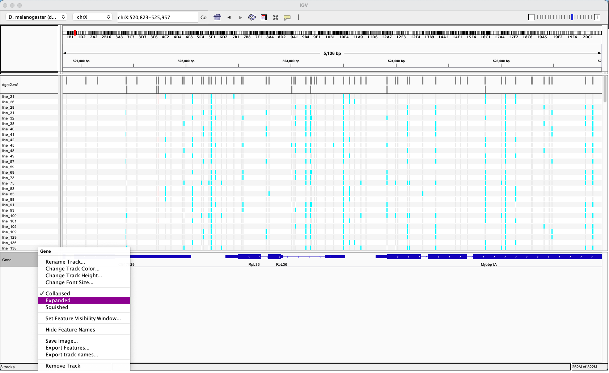
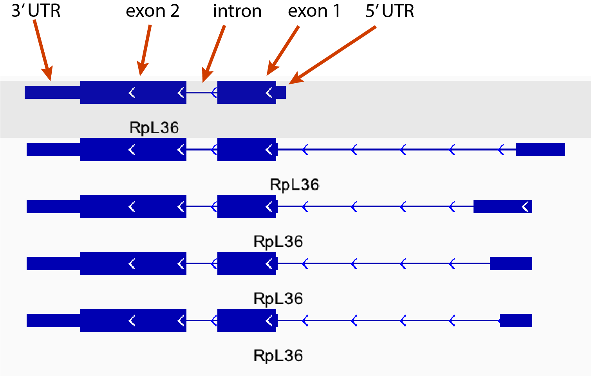
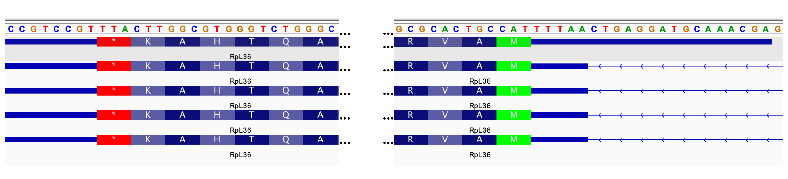
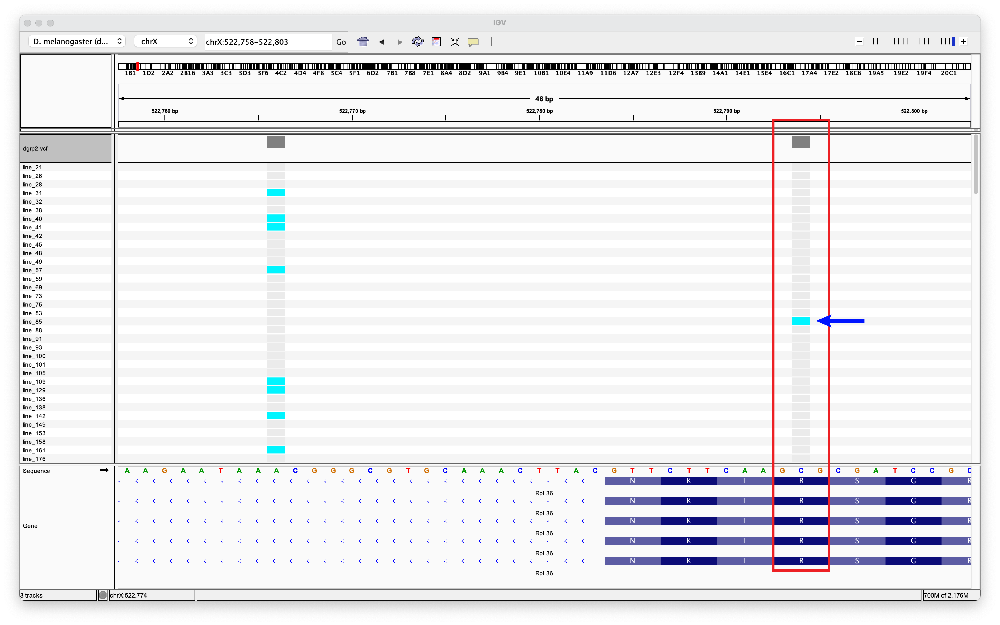
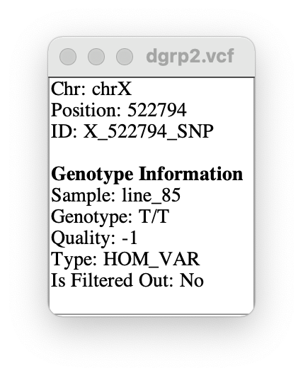

## Visualizing Genetic Variation in _Drosophila_ Genes

Below is a worked example of how to explore gene regions in IGV using the 60S ribosomal protein L36 (RpL36) as an example. It is designed for you to follow along in IGV. An exercise on visualizing genetic variation in two additional _Drosophila_ genes can be found at the end of the PDF.

 

#### 1. Open IGV and reload the dgrp2 VCF file

- "File" --> "Load from File..." --> choose the `dgrp2.vcf` file from your dgrp_vcf folder.
 
- The default genome should still be set to the _D. melanogaster_ dm3 reference genome. If it is not, see steps 2 and 3 of the IGV tutorial.

 

#### 2. Navigate to a gene's location using the search box

- As described in step 7 of the IGV tutorial, you can jump to the location of a gene using the search box at the top of the IGV window. Simply type a valid gene name into the search box and press "Go" (shown below for RpL36).

 

#### 3. Expanding the gene panel

- After navigating to a gene's location, you will see the focal gene at the center of the gene panel at the bottom of the IGV window.

- By default, the gene panel is in "Collapsed" mode. However, genes can overlap each other if they are coded on opposite strands of the DNA molecule, and these genes will not be separately shown in Collapsed mode. Also, there is often more than one version of a gene because of [alternative splicing](https://en.wikipedia.org/wiki/Alternative_splicing). An aggregate of all versions is shown in Collapsed mode, but we would like to view all possible versions separately.

- To switch to "Expanded" mode, right click on the gene panel and select "Expanded", as depicted in the image below.

 

#### 4. The IGV gene model

- After expanding the gene panel, you will see all the possible gene versions, with the primary version at the top. In the case of RpL36, there are 5 possible versions of the gene (see below).

- The gene models include 5'UTRs, exons, introns, and 3'UTRs. These are indicated in the image below for RpL36.

 

- **NOTE:** Recall that DNA molecules have two strands of nucleotides, and that the sequence of each is the reverse-complement of the other. However, as a rule, the reference sequence is only one strand of the DNA molecule. Because genes can be coded on either strand, the IGV gene models include arrows that indicate the direction of the gene relative to the reference sequence. In the case of RpL36, the arrows run in the opposite direction relative to the reference, indicating that RpL36 is coded on the opposite strand. Its coding sequence will therefore be the reverse-complement of the reference sequence.

 

#### 5. Amino acid sequence

- When zoomed in further, the gene model will include the amino acid sequence of the protein, as well as start and stop codons (highlighted in green and red, respectively). Again, because of the orientation of RpL36 relative to the reference sequence, the gene runs from right to left.

 

#### 6. Examining the details of a Single Nucleotide Polymorphism (SNP)

- The image below shows the junction between the first exon and the first intron of RpL36. In the DGRP, there is only one SNP in the first exon of RpL36 (highlighted in the red box). **Individuals that carry the alternate allele are shown in cyan, while individuals with the reference allele are shown in gray.** As can be seen by looking at the reference sequence, the reference allele at this site is a "C". We can also see that it is the second codon position of the amino acid arginine (R).

- Notice that there is no genome sequence for any of the DGRP lines - only variable sites are shown. The sequence for each DGRP line is assumed to be the same as the reference except for where there is a highlighted variant. At highlighted sites, as mentioned above, all individuals in gray have the same nucleotide as the reference, whereas those in cyan carry the alternate allele.

- Clicking on a SNP will generate a pop-up box containing information about the SNP. Shown below is information on the SNP indicated by the blue arrow in the image above. From this, we can see that the sequenced individual from line_85 of the DGRP is homozygous for "T", while the reference sequence is "C".

---

 

# Exploring genetic variation exercise

In IGV, navigate to the following two genes:
1. RpL12
2. DptA (Diptericin A)

How many variants in total are found in the exons of RpL12?

Which part of the RpL12 gene (3'UTR, exons, introns, 5'UTR) has the most variants?

List the number of variants for each part of the DptA gene.

What is the reference allele of the first SNP in exon 1 of DptA.

Read about the function and full name of each of these genes? (search for genes on http://flybase.org/). 

